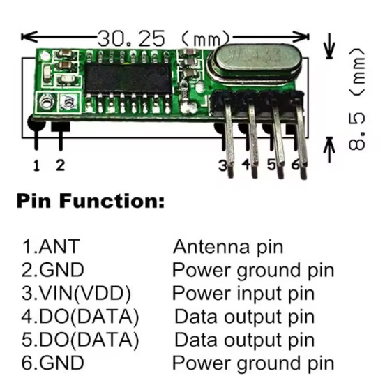

# HCS301_receiver
ESP32 S3 zero receiver for HCS301
Simply connect 433MHz receiver like this to pin 4 of ESP32.
This particular receiver can work on 3.3V and 5V. So you can power it up from ESP 3.3V pin.

HSC is sending:
Preamble: 12 high and 12 low pulses each 400uS.
Header: 10 low pulses
Data: 66 bits of information - 34 bits unencrypted and 32 encrypted.
Please, refer to datasheet for more information.

Here is the result when I press button 1 of by remote.
Buff:0,0,0,1,1,1,1,0,0,1,1,0,0,0,1,0,0,1,1,1,1,0,0,0,0,1,1,0,0,0,1,0,0,0,1,0,1,0,1,0,1,1,0,0,1,0,1,0,0,1,1,1,0,0,0,0,0,0,0,0,0,0,1,0,0,0,

Encrypted date: 0,0,0,1,1,1,1,0,0,1,1,0,0,0,1,0,0,1,1,1,1,0,0,0,0,1,1,0,0,0,1,0,0,0 I dont care about this one.
Serial number is: 1,0,1,0,1,0,1,1,0,0,1,0,1,0,0,1,1,1,0,0,0,0,0,0,0,0,0,0
S3 pressed
S0 released
Vlow: no
Replay: no

